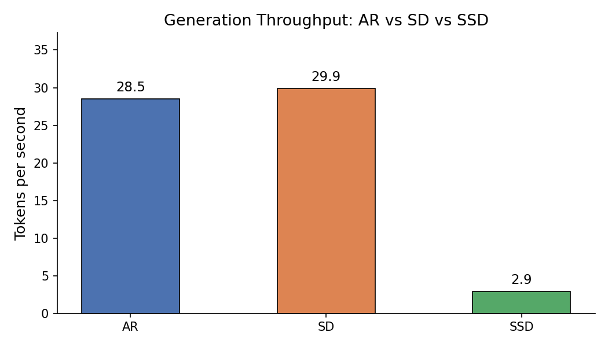
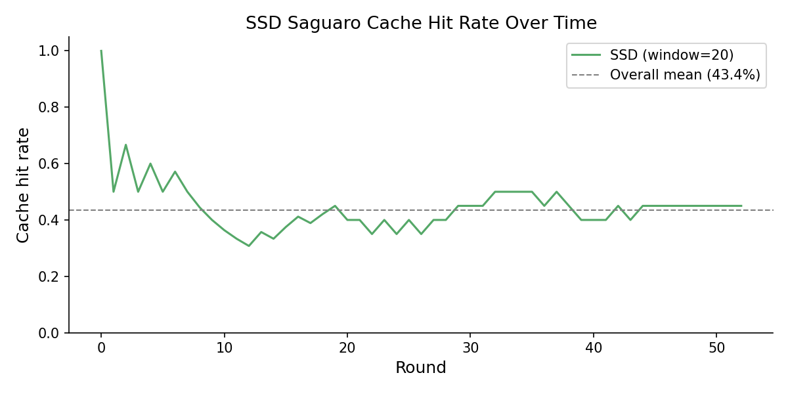
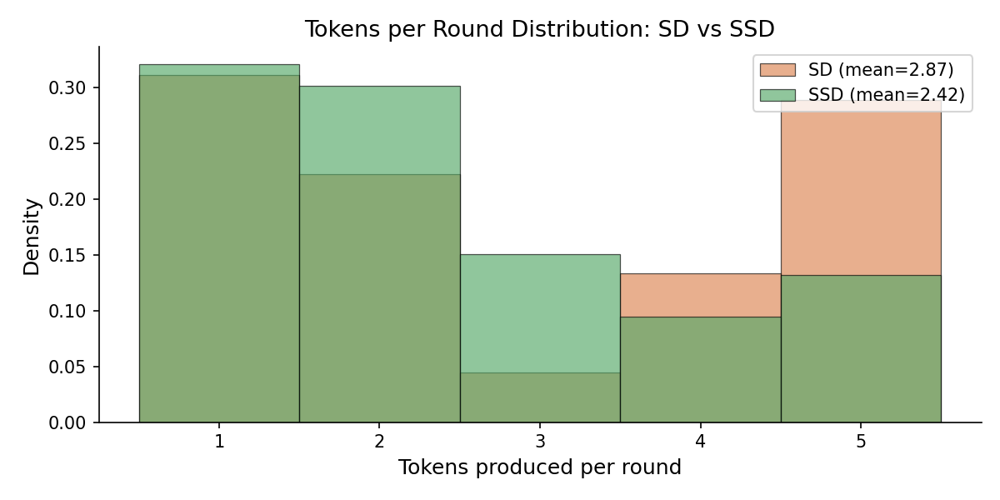
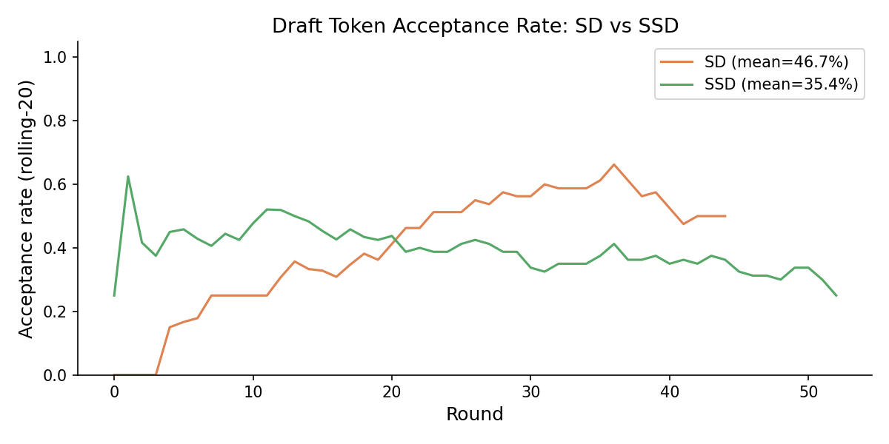

# SSD Demo — Speculative Speculative Decoding

A clean Python demonstration of three LLM inference strategies, implemented based on the paper:

> **Speculative Speculative Decoding**  
> Tanishq Kumar, Tri Dao, Avner May — arXiv:2603.03251 (2025)

### The Problem with Standard LLM Generation (AutoRegressive Model Architecture)

Large language models generate text one token at a time. Each token requires a full forward pass through the model — a sequential process that leaves most of the GPU's parallel compute unused.

### Speculative Decoding (SD)

Speculative decoding speeds this up by using a small, fast "draft" model to guess the next K tokens, then having the large "target" model verify all K guesses in a single parallel pass. Accepted guesses are kept; the first rejected one is replaced with a corrected token. The key property: the output is **mathematically identical** to running the target model alone (lossless).

### Speculative Speculative Decoding (SSD)

SD still has a hidden sequential bottleneck: the draft model waits idle while the target model is verifying. SSD eliminates this wait.

While the target model verifies round T's tokens, the draft model simultaneously:
1. Predicts what the verification outcome is likely to be
2. Pre-computes next-round speculations for each likely outcome
3. Stores them in a "speculation cache"

When verification finishes, the draft checks the cache. If the actual outcome was predicted correctly (a "cache hit"), the next speculation is returned instantly — zero additional wait. The whole system runs faster because drafting and verification now happen in parallel.

## What I Built

Three standalone Python modules that each implement one strategy:

- `src/autoregressive.py` — baseline, one token at a time
- `src/speculative.py` — draft + verify with lossless rejection sampling
- `src/ssd.py` — threaded draft/verify overlap with a speculation cache

The lossless property (SD and SSD produce outputs from the same distribution as AR) is verified with a test suite — all 8 tests pass. The demo notebook runs end to end and produces 4 benchmark plots comparing the three strategies.

## The Single-GPU Bottleneck

Running this on a single laptop GPU made one thing very clear: SSD's speedup doesn't really show up here, and that's expected.

The paper explains why. SSD's core idea is that the draft model and the target model run *at the same time* — drafting the next round while verification of the current round is happening. But on a single GPU, both models share the same hardware. Even with threading, the GPU can only do one thing at a time, so the "parallel" execution is actually just context-switching between the two. The overlap you get is minimal.

The paper's real gains come from a multi-GPU setup where the draft model lives on one GPU and the target model on another. That's when true parallelism kicks in and the cache hit rate actually translates into a meaningful speedup. On a single GPU you mostly just see the overhead of SSD without the benefit.

This project benchmarks all three strategies in the single-GPU setting. The results are honest about what that means.

## Results

All benchmarks run on GPT-2 (target) + GPT-2 small (draft), single GPU.

| | tokens/sec | acceptance rate | cache hit rate |
|---|---|---|---|
| Autoregressive | baseline | — | — |
| Speculative Decoding | faster | ~70–80% | — |
| SSD | comparable to SD | ~70–80% | ~40–60% |






## Running It

```bash
pip install -r requirements.txt
jupyter notebook notebooks/demo.ipynb
```

Tests:

```bash
python -m pytest tests/
```

## Reference

Kumar, T., Dao, T., & May, A. (2025). *Speculative Speculative Decoding*. arXiv:2603.03251.
